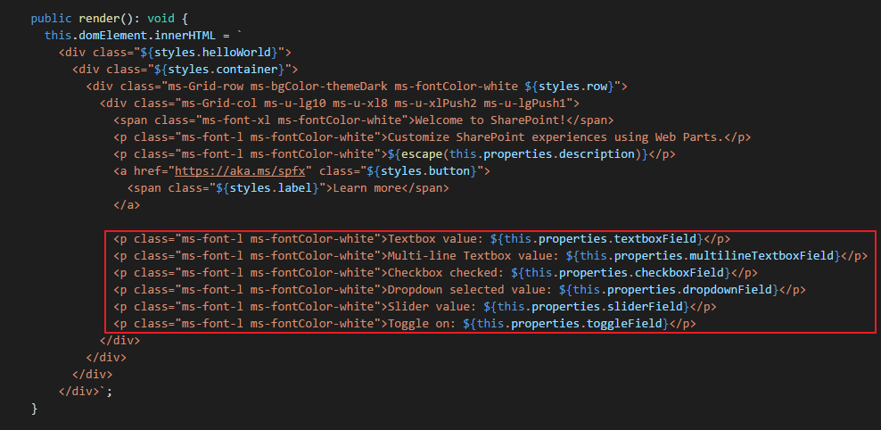
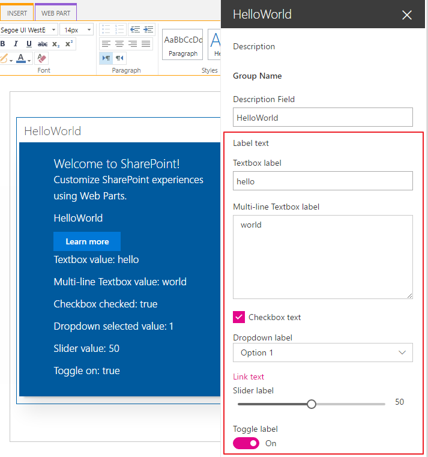
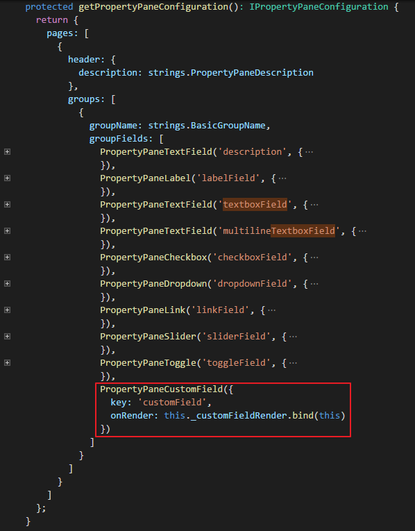
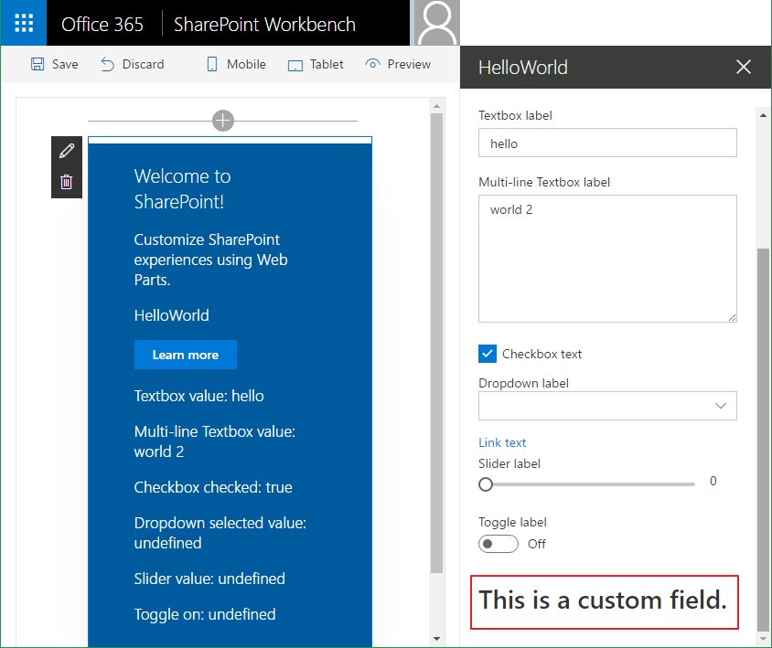
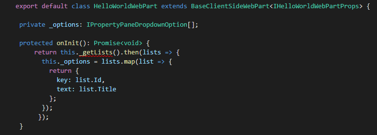
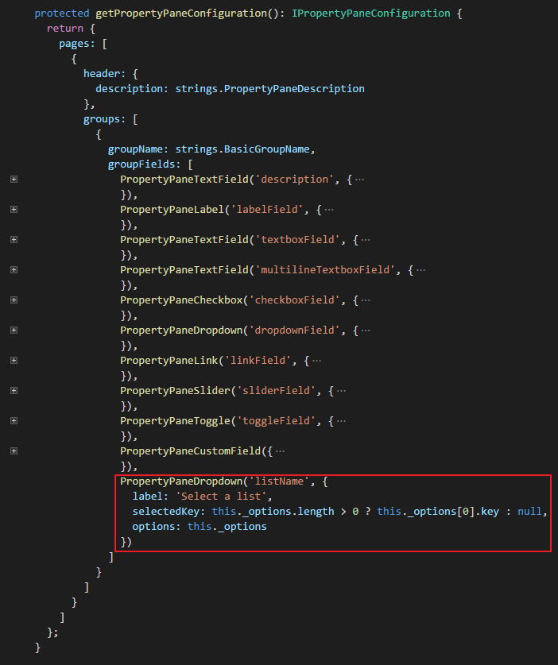
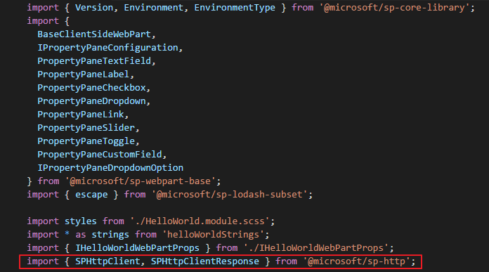
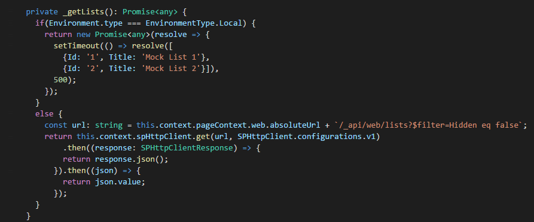
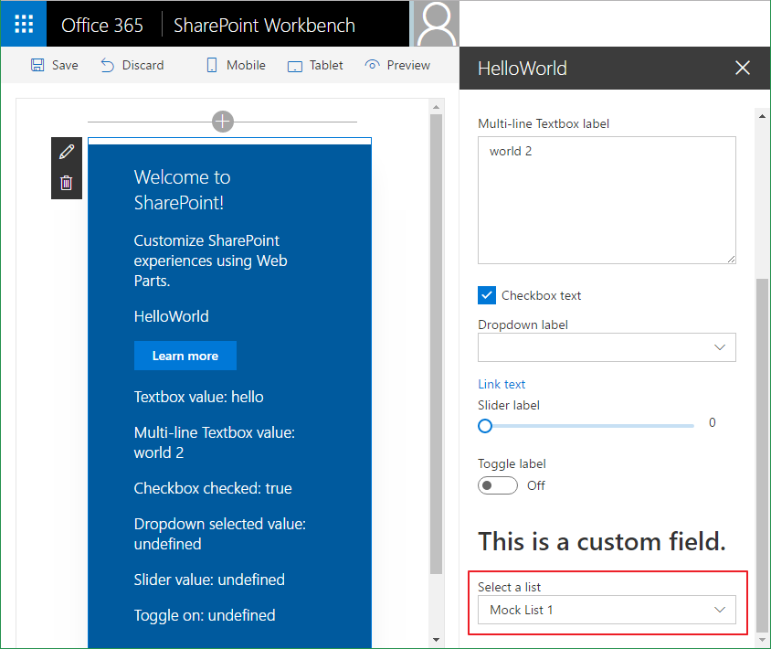
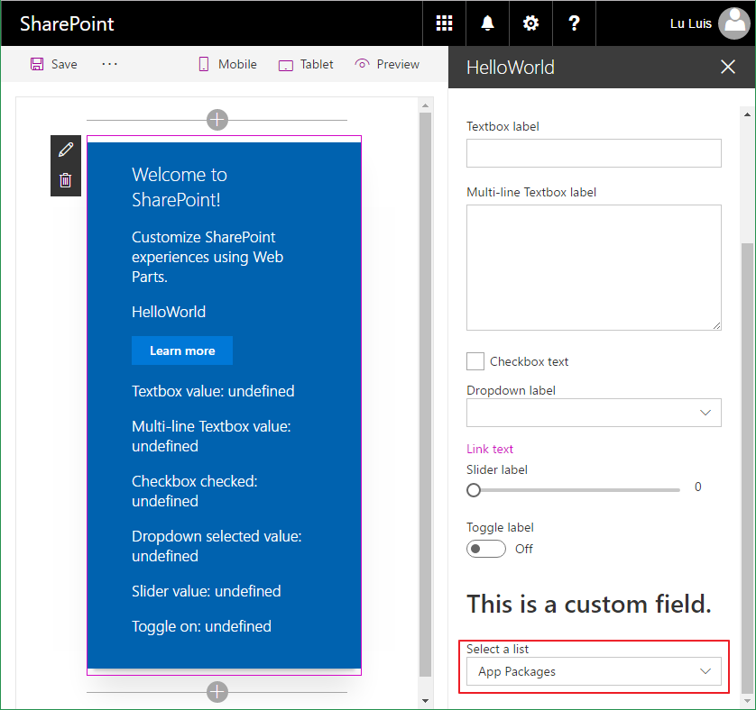

# Working with the web part property pane #
In this lab, you will walk through an introduction of the property pane and building custom fields.

## Prerequisites ##
Make sure you have completed the procedures in the following sections of [Getting Started with the SharePoint Framework (SPFx)](../Module-1/Lab.md) module: 
- [Setup development environment](../Module-1/Lab.md#setup-development-environment)
- [Setup Office 365 tenant](../Module-1/Lab.md#setup-office-365-tenant)

## Exercise 1: Working with the web part property pane ###
In this exercise you will continue to enhance the **HelloWorld** web part created in [Getting Started with the SharePoint Framework (SPFx)](../Module-1/Lab.md).  You will modify the web part to add a bunch of properties to the property pane.

The property pane has three key elements:

- Pages
- Header
- Groups

**Pages** provide you the flexibility to separate complex interactions and put them into one or more pages. Pages then contain Header and Groups.

The **Header** allows you to define the title of the property pane.

**Groups** let you define the various sections in the property pane to group properties.

A property pane should contain a page, an optional header, and at least one group.

Property fields are then defined inside a group.

#### Property pane fields ####
The following field types are supported:

* Label
* Textbox
* Multi-line Textbox
* Checkbox
* Dropdown
* Link
* Slider
* Toggle
* Custom

### Using the property pane ###

1. Open a **Command Prompt** window.
2. Change to the **helloworld-webpart** directory created in [Getting Started with the SharePoint Framework (SPFx)](../Module-1/Lab.md).
3. Open the **HelloWorld** web part project in Visual Studio Code, or your preferred IDE.

	>**Note:** To open in Visual Studio code enter **code .** on the command line.

	

4. Open the **IHelloWorldWebPartProps.ts** file and replace the **IHelloWorldWebPartProps** interface with the following code.

	````
	export interface IHelloWorldWebPartProps {
	  description: string;
	  labelField: string;
	  textboxField: string;
	  multilineTextboxField: string;
	  checkboxField: boolean;
	  dropdownField: string;
	  linkField: string;
	  sliderField: number;
	  toggleField: boolean;
	}
	````

	>**Note**: This file is the interface in your web part class that includes one or more target properties.  In this case, 9 properties are added to the interface.

5. Open the **HelloWorldWebPart.ts** file.
6. Add the following types to the `@microsoft/sp-webpart-base` imports.

	````
	PropertyPaneLabel,
	PropertyPaneCheckbox,
	PropertyPaneDropdown,
	PropertyPaneLink,
	PropertyPaneSlider,
	PropertyPaneToggle
	````

	>**Note**: These types are used to define the controls used to display/set property values in the property pane.

7. Replace the **getPropertyPaneConfiguration** method with the following code.

	````
    protected getPropertyPaneConfiguration(): IPropertyPaneConfiguration {
      return {
        pages: [
          {
            header: {
              description: strings.PropertyPaneDescription
            },
            groups: [
              {
                groupName: strings.BasicGroupName,
                groupFields: [
                  PropertyPaneTextField('description', {
                    label: strings.DescriptionFieldLabel
                  }),
                  PropertyPaneLabel('labelField', {
                    text: 'Label text'
                  }),
                  PropertyPaneTextField('textboxField', {
                    label: 'Textbox label'
                  }),
                  PropertyPaneTextField('multilineTextboxField', {
                    label: 'Multi-line Textbox label',
                    multiline: true
                  }),
                  PropertyPaneCheckbox('checkboxField', {
                    text: 'Checkbox text'
                  }),
                  PropertyPaneDropdown('dropdownField', {
                    label: 'Dropdown label',
                    options: [
                      {key: '1', text: 'Option 1'},
                      {key: '2', text: 'Option 2'},
                      {key: '3', text: 'Option 3'}
                    ]
                  }),
                  PropertyPaneLink('linkField', {
                    text: 'Link text',
                    href: 'https://dev.office.com/sharepoint/docs/spfx',
                    target: '_blank'
                  }),
                  PropertyPaneSlider('sliderField', {
                    label: 'Slider label',
                    min: 0,
                    max: 100
                  }),
                  PropertyPaneToggle('toggleField', {
                    label: 'Toggle label',
                    onText: 'On',
                    offText: 'Off'
                  })
                ]
              }
            ]
          }
        ]
      };
    }
	````

	> **Note**: The **getPropertyPaneConfiguration** is a method of type IPropertyPaneConfiguration and returns a collection of property pane page(s), their associated header, and the groups they contain.

8. Add the following code in **render** method.

	````
	<p class="ms-font-l ms-fontColor-white">Textbox value: ${this.properties.textboxField}</p>
	<p class="ms-font-l ms-fontColor-white">Multi-line Textbox value: ${this.properties.multilineTextboxField}</p>
	<p class="ms-font-l ms-fontColor-white">Checkbox checked: ${this.properties.checkboxField}</p>
	<p class="ms-font-l ms-fontColor-white">Dropdown selected value: ${this.properties.dropdownField}</p>
	<p class="ms-font-l ms-fontColor-white">Slider value: ${this.properties.sliderField}</p>
	<p class="ms-font-l ms-fontColor-white">Toggle on: ${this.properties.toggleField}</p>
	````
	
	
	
	> **Note**: The Label and Link fields are read-only, you can't access them in your web part using the **this.properties**.  In this example, this HTML output the values of the properties set in the property pane.
	> You do not have to display the values of web part properties in your web parts, you may just use them in the JavaScript code that supports your web part at runtime.  In this example all of the property values are displayed for demonstration purposes.

9. Package and deploy the **HelloWorld** web part to your app catalog site, install the client-side solution on your team site, and then add the **HelloWorld** web part to a **classic** and a **modern** page.

	> **Note**: If you are new to packaging and deploying web parts and create pages, see the [Deep Dive of the SharePoint Framework (SPFx)](../Module-2/Lab.md).

10. Open the **classic** and **modern** pages, then edit the web part. The following figures show the property pane in your SharePoint team site.
	
	**Classic Page**

	

	**Modern Page**

	

### Handling field changes ###

The property pane has two interaction modes:

* Reactive
* Non-reactive

In **reactive** mode, on every change, a change event is triggered. Reactive behavior automatically updates the web part user interface with the new values.

While reactive mode is sufficient for many scenarios, at times you will need non-reactive behavior. Non-reactive does not update the web part user interface automatically unless the user confirms the changes.

## Exercise 2: Building custom property pane fields ##
In this exercise you will continue to enhance the **HelloWorld** web part created in [Getting Started with the SharePoint Framework (SPFx)](../Module-1/Lab.md).  You will modify the web part to add a custom property to the property pane.

1. Open a **Command Prompt** window.
2. Change to the **helloworld-webpart** directory created in **exercise 1**.
3. Open the **HelloWorld** web part project in Visual Studio Code, or your preferred IDE.

### Add a custom field ###

1. Open the **IHelloWorldWebPartProps.ts** file.
2. Add the following field definition in the **IHelloWorldWebPartProps** interface.

	````
	customField: string;
	````
	
3. Open the **HelloWorldWebPart.ts** file.
4. Add the **PropertyPaneCustomField** type to the `@microsoft/sp-webpart-base` imports.

	````
	,PropertyPaneCustomField
	````

5. Add the following method under **getPropertyPaneConfiguration**.

	> **Note**: The **_customFieldRender** method renders a div in the HTMLElement.

	````
	private _customFieldRender(elem: HTMLElement): void {
	    elem.innerHTML = '<div><h1>This is a custom field.</h1></div>';
	}
	````
	
	

6. Add the following code in **groupFields** array in **getPropertyPaneConfiguration** method to make the field appear in the property pane.
	
	````
	,PropertyPaneCustomField({
      key: 'customField',
      onRender: this._customFieldRender.bind(this)
    })
	````

	

7. Preview the web part in your local workbench and notice the custom field is displayed.

	> **Note**: If you didn't install and trust a developer certificate on your machine, please install it on your machine.
	> 1. Open a **Command Prompt** window and change to the **helloworld-webpart** directory.
	> 2. Type **gulp trust-dev-cert** and press **Enter**.

	

### Loading async data into a property pane field ###

1. Open the **IHelloWorldWebPartProps.ts** file.
2. Add the following field definition in the **IHelloWorldWebPartProps** interface.

	````
	listName: string;
	````

3. Open the **HelloWorldWebPart.ts** file.
4. Add the **IPropertyPaneDropdownOption** type to the `@microsoft/sp-webpart-base` imports.

	````
	,IPropertyPaneDropdownOption
	````

5. Change the import statement `import { Version } from '@microsoft/sp-core-library';` to the following code to import the **Environment** and **EnvironmentType** library:

	````
	import { Version, Environment, EnvironmentType } from '@microsoft/sp-core-library';
	````

6. Add the following code in **HelloWorldWebPart** class.

	> **Note**: The following code defines the _options variable that stores the results from the _getLists method.
	> The onInit method invokes the **_getLists** method which will be added later to return the lists in the SharePoint site where the web part is executing, then adds the lists to the _options variable.

	````
	private _options: IPropertyPaneDropdownOption[];
	
	protected onInit(): Promise<void> {
		return this._getLists().then(lists => {
		  this._options = lists.map(list => {
		    return {
		      key: list.Id,
		      text: list.Title
		    };
		  });
		 });
	}
	````
 
	

7. Add the following code in **groupFields** array in **getPropertyPaneConfiguration** method.

	````
	,PropertyPaneDropdown('listName', {
      label: 'Select a list',
	  selectedKey: this._options.length > 0 ? this._options[0].key : null,
      options: this._options
    })
	````

	

8. Add the following code to import class **SPHttpClient**:

	````
	import { SPHttpClient, SPHttpClientResponse } from '@microsoft/sp-http';
	````

	

9. Add the following in **HelloWorldWebPart** class.

	> **Note**: The **_getLists** method returns the mock data if the web part executes in your local workbench.  If the web part executes in a SharePoint site it invokes the SharePoint REST API and returns the names of the lists in the SharePoint site.

	````
    private _getLists(): Promise<any> {
        if(Environment.type === EnvironmentType.Local) {
          return new Promise<any>(resolve => {
            setTimeout(() => resolve([
              {Id: '1', Title: 'Mock List 1'},
              {Id: '2', Title: 'Mock List 2'}]),
            500);
          });
        }
        else {
		  const url: string = this.context.pageContext.web.absoluteUrl + `/_api/web/lists?$filter=Hidden eq false`;
          return this.context.spHttpClient.get(url, SPHttpClient.configurations.v1)
              .then((response: SPHttpClientResponse) => {
              return response.json();
            }).then((json) => {
              return json.value;
            });
        }
    }
	````

	

9. Preview the web part in the SharePoint workbench on your Office 365 developer site or in the local workbench.

	> **Note**: If you didn't install and trust a developer certificate on your machine, please install it on your machine.
	> 1. Open a **Command Prompt** window and change to the **helloworld-webpart** directory.
	> 2. Type **gulp trust-dev-cert** and press **Enter**.

	In the local workbench the dropdown displays the mock data.
	
	

	In a workbench running in a SharePoint site the dropdown will display the list names.
  
	
